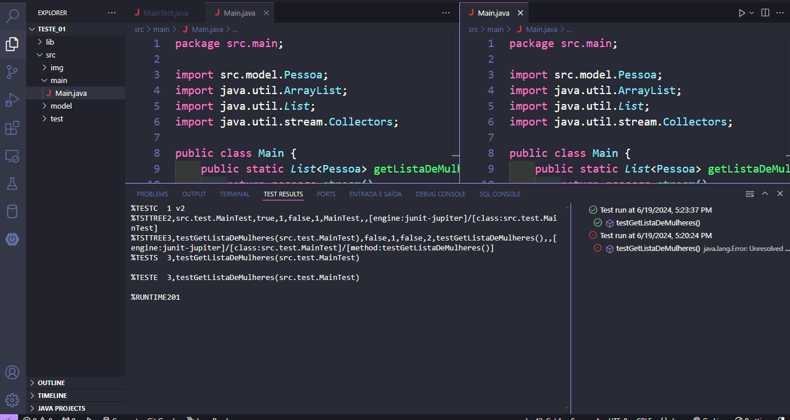

<!DOCTYPE html>
<html lang="pt-br">
<head>
    <meta charset="UTF-8">
    <meta name="viewport" content="width=device-width, initial-scale=1.0">
    <meta name="description" content="Projeto Java de Filtragem de Dados com Streams">
    <meta name="keywords" content="Java, Streams, JUnit, Filtragem de Dados, Projeto Acadêmico">
    <meta name="author" content="Ana Alice Rodrigues">
    <title>Projeto Java - Filtragem de Dados com Streams</title>
</head>
<body>

<header>
    <h1>Projeto Java - Filtragem de Dados com Streams</h1>
    
    
</header>

    
Índice

    <ol>
        <li><a href="#sobre-o-projeto">Sobre o projeto</a></li>
        <li><a href="#parte-tecnica">Parte Técnica</a></li>
        <li><a href="#estrutura-dos-arquivos">Estrutura dos Arquivos</a></li>
        <li><a href="#casos-de-uso">Casos de Uso</a></li>
        <li><a href="#ferramentas">Ferramentas</a></li>
        <li><a href="#contato">Contato</a></li>
    </ol>

<section id="sobre-o-projeto">
    <h2>Sobre o projeto</h2>
    

        Este projeto tem como objetivo demonstrar a utilização de Streams em Java para filtrar dados de uma lista. A aplicação cria uma lista de pessoas com seus respectivos nomes e gêneros, e utiliza Streams para filtrar e selecionar apenas as mulheres.
    

    

        Proposta de Valor: Mostrar como as funcionalidades de Streams e Lambda Expressions do Java podem simplificar a manipulação de coleções de dados, tornando o código mais eficiente e legível.
    

</section>

<section id="parte-tecnica">
    <h2>Parte Técnica</h2>
    <ul>
        <li>Backend: Java é utilizado para toda a lógica de manipulação de dados.</li>
        <li>IDE: VS Code é utilizado para o desenvolvimento e execução do código Java.</li>
        <li>Testes: JUnit é utilizado para realizar testes unitários, garantindo a funcionalidade correta do código.</li>
    </ul>
</section>

<section id="estrutura-dos-arquivos">
    <h2>Estrutura dos Arquivos</h2>
    <ul>
        <li><strong>src/main/Main.java</strong>: Contém a lógica principal do programa, incluindo a criação e filtragem da lista de objetos Pessoa.</li>
        <li><strong>src/model/Pessoa.java</strong>: Define a classe Pessoa com atributos nome e gênero, além de métodos getters.</li>
        <li><strong>src/test/MainTest.java</strong>: Contém os testes unitários que verificam se a filtragem da lista de pessoas está funcionando corretamente.</li>
    </ul>
</section>

<section id="casos-de-uso">
    <h2>Casos de Uso</h2>
    <ul>
        <li>Criação de uma lista de pessoas com nome e gênero.</li>
        <li>Filtragem da lista para selecionar apenas as mulheres utilizando Streams e Lambda Expressions.</li>
        <li>Impressão no console da lista original e da lista filtrada.</li>
        <li>Teste unitário para verificar se a lista filtrada contém apenas mulheres, utilizando JUnit.</li>
    </ul>
</section>

<section id="ferramentas">
    <h2>Ferramentas</h2>
    <ul>
        <li></li>
        <li></li>
        <li></li>
    </ul>
</section>

<section id="contato">
    <h2>Contato</h2>
    <ul>
        <li></li>
    </ul>
</section>

</body>
</html>

